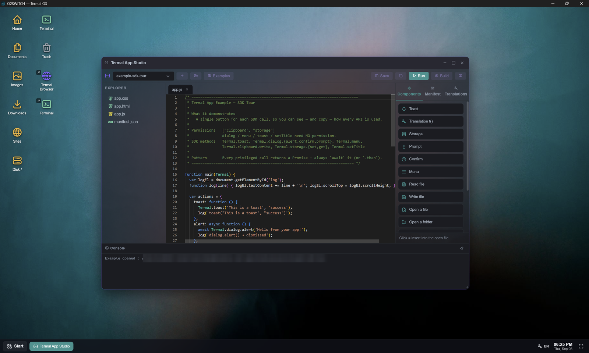
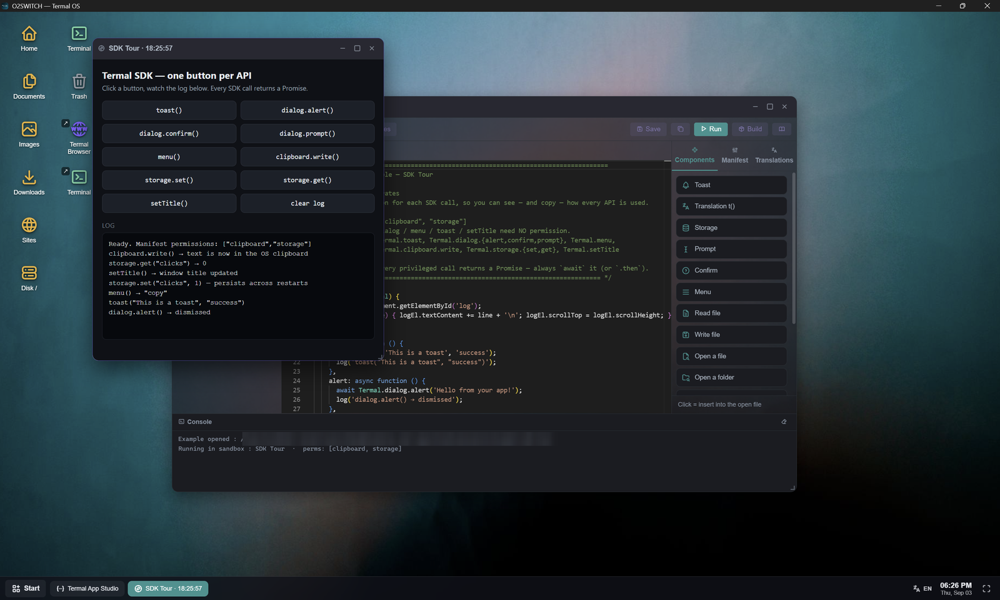
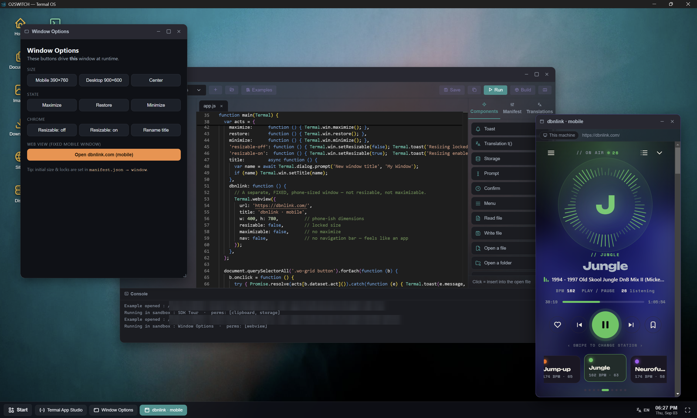

# Termal OS SDK &amp; examples

Build your own mini-apps for **[Termal OS](https://termalos.com)** with **Termal Studio** - the
in-app builder. This repository holds the developer documentation and **every example app** that
ships with the Studio, so you can read, clone and adapt them freely.

> New to Termal OS? It turns your Linux servers into a real desktop over SSH - agentless,
> local-first. Download it at **[termalos.com/download](https://termalos.com/download)**.

## See it in action

**Termal Studio** is the in-app builder: write, run and build a mini-app without leaving Termal OS,
with a live component palette, a manifest editor and translations.

Every example is one self-contained app. **SDK Tour** puts a button on each `Termal.*` API, so you
can see - and copy - exactly how every call is used:

Apps get real windows, dialogs, storage, clipboard and an embedded browser. **Window Options**
drives its own window at runtime and opens a fixed, phone-sized web view:

## What's in here

| Folder | Contents |
|--------|----------|
| [`examples/`](examples/) | Every ready-to-run example app from the Studio, one folder each, heavily commented. |
| [`docs/`](docs/) | SDK reference: the `Termal.*` API, the `.tapp` format, the file-access model. |

Full narrative guide and API overview: **[termalos.com/developers](https://termalos.com/developers)**.

## Using an example

1. Open **Termal Studio** inside Termal OS.
2. Either click **Examples** in the toolbar and pick one, or copy an example from this repo into a
   new project (`File → New project`, then paste the files).
3. Run it, read the comments, adapt it to your need.

Each example is self-contained and independent - start from whichever is closest to what you want.

## Feedback &amp; support

- 🐞 Found a bug? [Open an issue](https://github.com/TermalOS/feedback/issues/new/choose).
- 💡 Have an idea? [Request a feature](https://github.com/TermalOS/feedback/issues/new/choose).
- 💬 A question? Head to [Discussions](https://github.com/TermalOS/feedback/discussions).

Security issue? Report it privately via the [security policy](https://github.com/TermalOS/.github/blob/main/SECURITY.md), never in a public issue.

## License

All example apps and documentation in this repository are released under the **[MIT License](LICENSE)** -
use them, modify them, ship them, no strings attached. (Termal OS itself, the desktop application,
is a separate proprietary product.)

## Links

- 🌐 Site - https://termalos.com
- ⬇️ Download - https://termalos.com/download
- 📖 Developer overview - https://termalos.com/developers
- 🏢 Organization - https://github.com/TermalOS
